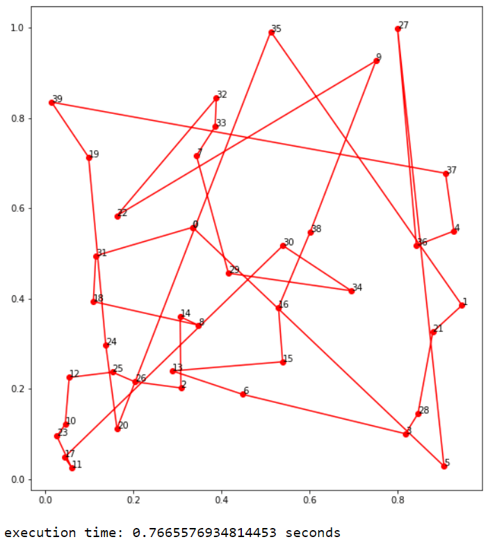

# Муравьи и Python: ищем самые короткие пути


Часто бывает, что для того, чтобы найти лучшее решение задачи методом полного перебора,
необходимо проанализировать слишком много вариантов, следовательно, потратить время и вычислительные ресурсы.
Алгоритмы оптимизации помогают найти решение задачи, приближенное к идеальному.
Возможно, не самое лучшее из всех возможных, но точно одно из лучших.

Алгоритмов оптимизации существует очень много. Сегодня будет разобран один из самых известных алгоритмов, заимствованных у природы – муравьиный алгоритм (ACO – Ant Colony Optimization).

Идея муравьиного алгоритма возникла в результате наблюдения за поведением реальных муравьёв. Отправной точкой положили исследования аргентинских муравьёв в 1989-1990 годах. Затем, в начале 90-х годов, Марко Дориго начал исследования для применения этой информации в практике. Он первый смог применить их стратегию для задачи по нахождению кратчайших маршрутов в графе.

Этот алгоритм оптимизации основан на поведении муравьиной колонии, которое позволяет насекомым находить наиболее удачный маршрут.


Суть алгоритма довольно проста: изначально муравьи доставляют еду в муравейник беспорядочно каждый своей дорогой, охватывая тем самым самые различные маршруты. Во время движения муравьи оставляют пахучий след из феромонов на своём пути, тем самым обозначая маршруты. Соответственно, чем дорога короче, тем большее количество раз за одинаковое время муравьи успеют по ней пройти и смогут оставить на ней больше феромонов. Феромоны имеют свойство испаряться с течением времени. Из-за этого на длинных маршрутах остаётся меньше феромонов, чем на коротких, даже если по ним будет передвигаться одинаковое количество муравьёв. Таким образом, муравьи будут чаще выбирать самую «пахучую тропинку» и забывать пути с меньшим количеством феромонов.

Этот механизм решения проблемы является примером отличной самоорганизации системы. Подобные механизмы, в которых даже самые простые индивиды могут сотрудничать и без контроля и планирования создавать сложные структуры, имеют научное название – стигмергия.

Пока (не выполнены условия выхода) выполняются следующие операции алгоритма:

### Создание муравьёв

В разных задачах начальное размещение муравьёв может быть разным. Это зависит от условий задачи. Ещё на этом шаге происходит первоначальное размещение небольшого количества феромона для того, чтобы на первом шаге вероятность перехода в соседнюю вершину была не нулевой.

### Поиск решений

Формула для вычисления вероятности перехода муравья из вершины i в j:

<center>


    =\frac{[\tau;_{ij}(t)]^{\alpha}[n_{ij}]^{\beta}}{\sum[\tau_{ij}(t)]^\alpha;[n_{ij}]^\beta})
</center>

где τij(t) – количество феромона между вершинами i и j, ηij – расстояние между этими вершинами. α, β – константные параметры. Их необходимо подбирать опытным путём, их значение должно быть такое, чтобы алгоритм не был слишком жадным и не застревал в локальных минимумах.

Чем ближе к нулю параметр β, тем меньше муравьи в выборе пути будут руководствоваться расстоянием между вершинами и будут ориентироваться только на феромон. С увеличением β значение близости растёт. Параметр α действует так же, но для уровня феромона.

Верхняя часть формулы описывает желание муравья перейти из вершины i в вершину j. Оно пропорционально близости вершины и уровню феромона на пути к ней.

Таким образом, вероятность перехода из вершины i в вершину j равняется желанию перейти в неё, делённому на сумму желаний перейти из вершины i ко всем доступным вершинам, которые ещё не были посещены. Сумма всех вероятностей равна 1.

Разложив все вероятности на числовой прямой от 0 до 1, можно сгенерировать рандомное вещественное число в этом интервале. Результат покажет, в какую вершину перейдёт муравей.

### Обновление феромона

Формула для пересчёта уровня феромона на каждой итерации алгоритма:

<center>

</center>

где ρ – скорость испарения, t – номер итерации, Lk(t) – цена текущего решения для k-ого муравья, а Q – параметр, имеющий значение порядка цены оптимального решения, то есть  – феромон, откладываемый k-ым муравьём, использующим ребро (i, j).

Таким образом, количество феромона на ребре между i и j на новой итерации равно количеству феромона на старой итерации, умноженное на коэффициент испарения (феромон постоянно испаряется), и к полученному результату добавляется сумма всех новых порций феромона, который отложили все муравьи на этом участке. Добавка феромона, которую делает муравей, проходя по ребру, равна константе Q, делённой на длину маршрута L, пройденную муравьём k, при условии, что это ребро попало в маршрут муравья.

Сложность муравьиного алгоритма зависит от количества вершин, количества муравьёв и времени жизни колонии.

При помощи алгоритма эффективно решать задачу на нахождение оптимального маршрута. Эту задачу принято называть задачей коммивояжёра (TSP – Travelling Salesman Problem).

Есть разные варианты постановки этой задачи. В классической постановке коммивояжёр (странствующий торговец) должен объехать определённое количество городов по замкнутому маршруту, посетив каждый из них только один раз. При этом, чем длина маршрута будет меньше, тем лучше.

Например, торговцу нужно посетить 5 городов и вернуться в исходный. Находясь в городе отправления, у него для выбора доступно 4 города. Дальше он делает выбор из трёх городов и так далее. Значит, количество всех возможных вариантов равно 4*3*2*1 = 24, то есть (n-1)!, где n – количество городов.

В этой постановке задачи торговцу нужно объехать все города и вернуться в исходный, а направление движения не имеет значения. Это называется симметричной задачей коммивояжёра. Следовательно, половину вариантов можно не учитывать, так как, например, варианты ABCDEA и AEDCBA будут эквивалентны. Значит, количество маршрутов для 5 городов равно 24/2=12, а конечная формула количества вариантов для симметричной задачи будет выглядеть так: (n-1)!/2.

Сложность задачи методом полного перебора растёт факториально. Несложно по формуле вычислить количество вариантов для большего количества городов:

| Количество городов  |   Количество возможных путей |
| --- | --- |
5| 12
6 |60
7| 360
8 |2 520
9 |20 160
10 |181 440
11 |1814 400
12 |19 958 400
13 |239 500 800
14 |3 113 510 400
15 |43 589 145 600
16 |653 837 184 000
17 |10 461 394 944 000
18 |177 843 714 048 000

Как мы видим, количество возможных путей при увеличении количества городов очень быстро растёт, и простым перебором вариантов (методом грубой силы) задачу становится решить гораздо менее возможно.

Задача коммивояжёра – одна из трансвычислительных задач. Это значит, что уже на довольно небольшом количестве городов (66 и более) лучшее решение простым методом перебора вариантов не может быть найдено никакими самыми мощными компьютерами меньше чем за миллиарды лет. Поэтому, гораздо разумнее находить решение этой задачи при помощи алгоритмов оптимизации.

Рассмотрим реализацию алгоритма на языке Python.

Код написан в соответствие с описанием алгоритма и формулами выше. В алгоритме есть два важных фактора: феромон τ и видимость η. Феромон τ относится к оставшейся информации на каждом пути, по которому проходят муравьи. Видимость η обозначает обратное расстояние между узлами. Вероятность P состоит из произведения феромона τ и видимости η и их суммы. При кратчайшем пути, высоком уровне феромона τ, а также высокой видимости η вероятность P становится выше. Следовательно, в строках 39-40 происходит подсчёт вероятности P. Затем, строка 41 выбирает последовательность кратчайших путей при помощи вероятности P. Наконец, строки 55-64 обновляют феромон τ с коэффициентом испарения ρ. Параметр Q – это сумма феромонов в постоянном значении. Вернувшись к строке 37, новая последовательность маршрутов определена для следующего вычисления.

```python
class ACO_TSP:  # класс алгоритма муравьиной колонии для решения задачи коммивояжёра
    def __init__(self, func, n_dim, size_pop=10, max_iter=20, distance_matrix=None, alpha=1, beta=2, rho=0.1):
        self.func = func
        self.n_dim = n_dim  # количество городов
        self.size_pop = size_pop  # количество муравьёв
        self.max_iter = max_iter  # количество итераций
        self.alpha = alpha  # коэффициент важности феромонов в выборе пути
        self.beta = beta  # коэффициент значимости расстояния
        self.rho = rho  # скорость испарения феромонов

        self.prob_matrix_distance = 1 / (distance_matrix + 1e-10 * np.eye(n_dim, n_dim))

        # Матрица феромонов, обновляющаяся каждую итерацию
        self.Tau = np.ones((n_dim, n_dim))
        # Путь каждого муравья в определённом поколении
        self.Table = np.zeros((size_pop, n_dim)).astype(int)
        self.y = None  # Общее расстояние пути муравья в определённом поколении
        self.generation_best_X, self.generation_best_Y = [], [] # фиксирование лучших поколений
        self.x_best_history, self.y_best_history = self.generation_best_X, self.generation_best_Y
        self.best_x, self.best_y = None, None

    def run(self, max_iter=None):
        self.max_iter = max_iter or self.max_iter
        for i in range(self.max_iter):
            # вероятность перехода без нормализации
            prob_matrix = (self.Tau ** self.alpha) * (self.prob_matrix_distance) ** self.beta
            for j in range(self.size_pop):  # для каждого муравья
                # точка начала пути (она может быть случайной, это не имеет значения)
                self.Table[j, 0] = 0
                for k in range(self.n_dim - 1):  # каждая вершина, которую проходят муравьи
                    # точка, которая была пройдена и не может быть пройдена повторно
                    taboo_set = set(self.Table[j, :k + 1])
                    # список разрешённых вершин, из которых будет происходить выбор
                    allow_list = list(set(range(self.n_dim)) - taboo_set)
                    prob = prob_matrix[self.Table[j, k], allow_list]
                    prob = prob / prob.sum() # нормализация вероятности
                    next_point = np.random.choice(allow_list, size=1, p=prob)[0]
                    self.Table[j, k + 1] = next_point

            # рассчёт расстояния
            y = np.array([self.func(i) for i in self.Table])

            # фиксация лучшего решения
            index_best = y.argmin()
            x_best, y_best = self.Table[index_best, :].copy(), y[index_best].copy()
            self.generation_best_X.append(x_best)
            self.generation_best_Y.append(y_best)

            # подсчёт феромона, который будет добавлен к ребру
            delta_tau = np.zeros((self.n_dim, self.n_dim))
            for j in range(self.size_pop):  # для каждого муравья
                for k in range(self.n_dim - 1):  # для каждой вершины
                    # муравьи перебираются из вершины n1 в вершину n2
                    n1, n2 = self.Table[j, k], self.Table[j, k + 1]
                    delta_tau[n1, n2] += 1 / y[j]  # нанесение феромона
                # муравьи ползут от последней вершины обратно к первой
                n1, n2 = self.Table[j, self.n_dim - 1], self.Table[j, 0]
                delta_tau[n1, n2] += 1 / y[j]  # нанесение феромона

            self.Tau = (1 - self.rho) * self.Tau + delta_tau

        best_generation = np.array(self.generation_best_Y).argmin()
        self.best_x = self.generation_best_X[best_generation]
        self.best_y = self.generation_best_Y[best_generation]
        return self.best_x, self.best_y

    fit = run
```

Граф, на котором будет происходить поиск решения, можно сгенерировать случайным образом. Сначала генерируются координаты точек, затем при помощи модуля spatial из библиотеки scipy происходит вычисление матрицы расстояний (расстояние от каждой вершины до каждой вершины).

```python
import numpy as np
from scipy import spatial

num_points = 2000 # количество вершин
points_coordinate = np.random.rand(num_points, 2)  # генерация рандомных вершин
print("Координаты вершин:\n", points_coordinate[:10], "\n")

# вычисление матрицы расстояний между вершин
distance_matrix = spatial.distance.cdist(points_coordinate, points_coordinate, metric='euclidean')
print("Матрица расстояний:\n", distance_matrix)
```

Вывод программы:


Для того чтобы добавить данным «реальности», представим, что эти вершины – это местоположение на карте банкоматов, которые необходимо посетить инкассаторам. Стоит отметить, что знаниями о том, как инкассация строит свои маршруты, мы не располагаем, но этот алгоритм – это один из вариантов того, как их маршруты можно оптимизировать.

Рассмотрим задачу с количеством муравьёв, равным 40 `(size_pop=40)`, итераций, равным 30 `(max_iter=30)` и вершин – 40. Функция `cal_total_distance` рассчитывает длину пути. Затем при помощи `matplotlib.pyplot` происходит вывод графиков. Также выводится время выполнения программы, которое мы дальше будем сравнивать для разного количества вершин.

```python

import time
import matplotlib.pyplot as plt
import pandas as pd

# вычисление длины пути
def cal_total_distance(routine):
    num_points, = routine.shape
    return sum([distance_matrix[routine[i % num_points], routine[(i + 1) % num_points]] for i in range(num_points)])

def main():
    # создание объекта алгоритма муравьиной колонии
    aca = ACO_TSP(func=cal_total_distance, n_dim=num_points,
                  size_pop=40,  # количество муравьёв
                  max_iter=10, distance_matrix=distance_matrix)
    best_x, best_y = aca.run()

    # Вывод результатов на экран
    fig, ax = plt.subplots(1, 2)
    best_points_ = np.concatenate([best_x, [best_x[0]]])
    best_points_coordinate = points_coordinate[best_points_, :]
    for index in range(0, len(best_points_)):
        ax[0].annotate(best_points_[index], (best_points_coordinate[index, 0], best_points_coordinate[index, 1]))
    ax[0].plot(best_points_coordinate[:, 0],
               best_points_coordinate[:, 1], 'o-r')
    pd.DataFrame(aca.y_best_history).cummin().plot(ax=ax[1])
    # изменение размера графиков
    plt.rcParams['figure.figsize'] = [20, 10]
    plt.show()

if __name__ == "__main__":
    start_time = time.time() # сохранение времени начала выполнения
    main() # выполнение кода
    print("time of execution: %s seconds" %abs (time.time() - start_time)) # вычисление времени выполнения

```

Чтобы убедиться, что алгоритм эффективен и способен искать оптимальный путь, для наглядности можно сначала значительно понизить точность алгоритма и посмотреть, как выглядит неоптимальный рандомный маршрут. Вот результат работы программы при количестве муравьёв и итераций, равных 1:



Как мы видим, маршрут очень длинный и беспорядочный. Никому бы не понравилось ездить по такому маршруту. Путём подбора значений параметров удалось выяснить, что при количестве муравьёв и итераций, равных 40 и 30 соответственно, алгоритм почти всегда останавливается на этом решении:


При увеличении параметров результат работы программы уже не меняется. Значит, этих значений алгоритму было достаточно, чтобы найти самый короткий и оптимальный замкнутый маршрут на карте.

40 – относительно небольшое число вершин. Можно посмотреть, как алгоритм будет вести себя на более сложных графах и как долго будет находить решение. При тех же параметрах на более сложных графах время работы алгоритма заметно увеличивается. Чтобы как-то сократить время выполнения, уменьшим количество муравьёв до 20 и итераций – до 5. Так выглядит результат работы на графе из 1000 вершин:


А так – на 2000:


Выглядит очень страшно. И выполнение заняло больше двух минут. Результат работы алгоритма для большего количества вершин (например, для 10000) дождаться было бы уже гораздо сложнее.

В рейтинге самых быстрых языков программирования Python стабильно занимает одно из последних мест. Зачастую логика, выполняющаяся на других языках за миллисекунды, на Python занимает несколько секунд. Существуют способы ускорения кода на Python. Например, пакет PyPy, который делает код быстрее. Или Cython – расширение языка, в котором поддерживается прямой вызов функций и методов C/C++ и строгая типизация. Он может ускорить работу более чем в 30 раз.

Также можно использовать реализацию алгоритма на другом языке программирования, например, на C/C++. Или научить программу эффективно использовать ресурсы компьютера: оптимизировать её под многопоточность и использовать код на ассемблере, чтобы обращаться к процессору напрямую, без компилятора высокого уровня. Но скорость и оптимизация кода – это уже тема для других объёмных статей.

Таким образом, мы разобрали, как работает муравьиный алгоритм и нашли с помощью него оптимальный маршрут. Предлагаю вам использовать этот алгоритм в качестве инструмента для решения своих задач.
